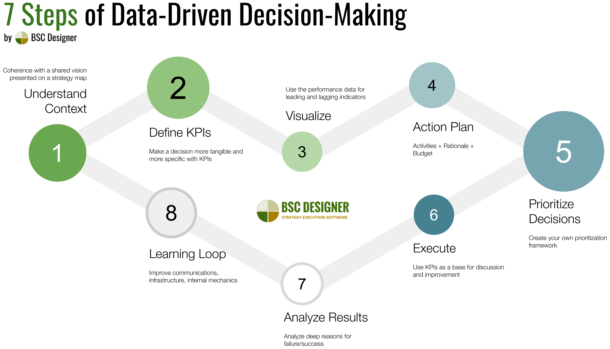
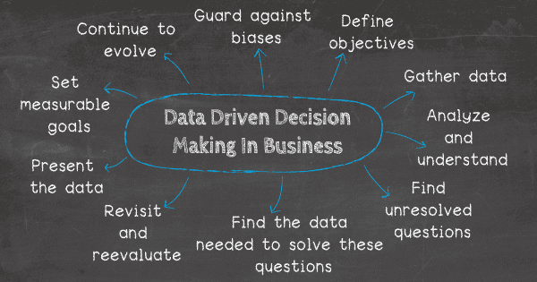

```{r setup, include=FALSE}
knitr::opts_chunk$set(echo = TRUE)
```

# Policy Amendments (Northern Cape)

## Background
During the past decade, advances in information technology have ignited a revolution in decision-making, from business to sports to policing. Previously, decisions in these areas had been heavily influenced by factors other than empirical evidence, including personal experience or observation, instinct, hype, and dogma or belief. The ability to collect and analyse large amounts of data, however, has allowed decision-makers to cut through these potential distortions to discover what really works

## Context

`Policy` - A course or principle of action adopted or proposed by an organization or individual. Policy is a deliberate system of guidelines to guide decisions and achieve rational outcomes. In simplicity a policy refers to the plans that a government or business follows. 

## Problem Statement
We wish to understand how Natural Resources and Human Development Index vary in Northern Cape cities and towns in order to develop accurate, effective and measurable policies for cities and towns in the Northern Cape. This means insights gained through the use of Northern Cape data about Natural Resources and Human Development Index should unlock insights that could inform policy decisions. 

## Question
Can cities and towns with similar Natural Resources and Human Development Index be identified for polices that are targeted to groups of cities and towns?
If no, why is that the case? What is the cause for these cities and town having different Natural Resources. 
If cities and towns with similar Natural Resources and Human Development Resources are identified, what kinds of policies can be recommended for these cities and towns?

## Aim 
We aim to cluster cities and towns in Northern Cape based on Natural Resources and Human Development index and use a different policy for cities and towns in each group. 

## Benefit of Data Driven Decision making for Policy Amendments 
`Important saying` - “Policy makers often make the right decision for the wrong reason” 

The body in charge of Northern Cape can draw from data to develop accurate, effective and measurable policies when planning how, to whom, with what content and where in the cities these services will be provided. In the case policy makers can make the right decisions that are driven from data. 


`Data Driven Decision Making in Business:` Business in a sense that, the solution brings some value to a client (Northern Cape Cities and Towns). In the Northern Cape policy context, this will be the value in which the solution brings forth for the cities or towns in Northern Cape. 


## Data Breakdown

### Natural Resources 
- `Availability of water:` Rainfall, Dams, Perennial rivers, Ground water potential, Boreholes
- `Agricultural Potential:` Crop production / Irrigated land, Grazing Capacity, Agro-processing facilities, Land capability, Aridity zones
- `Mining Potential:` Active mines, Mineral deposits, Mining applications
- `Tourism Potential:` Terrain index, Cultural and heritage sites
- `Environment Sensitivity:` Protected and Conservation Areas, Biodiversity and Geohazards, NFEPA rivers and wetlands. 

### Human development index
- `Education:` Primary education ( % > 20 years old with primary education only), Matric pass rate (% Matric pass rate 2017)
- `Income:` Average per capita income (personal income), Population living below breadline (% population living below national mean level of living in 2011) , Social grant dependency (% population receiving social grants)
-	`Occupation:` Unskilled workers (% of unskilled workers)
-	`Health Status:` HIV/AIDS status (% Population with HIV/AIDS)
-	`Housing:` Informal housing (% population living in informal housing units)

## Analysis 


Importing libraries 
```{r ,message=FALSE, warning=FALSE}
source("utils/loadpackages.R")
```

Reading data and selecting columns that belong to Natural Resources and Human Development Index
```{r warning=FALSE, message=FALSE}
data <- read_excel("NCdata.xlsx", sheet = "PERCENT", range = cell_rows(1:98))
data <- select(data, c(1, "Availability of Water", "Agricultural Potential",
                       "Mining Potential", "Tourism Potential", "Environmental Sensitivity",
                       "Education", "Income", "Occupation", 
                       "Health Status", "Housing"))
```

Renaming the first column to city 
```{r warning=FALSE, message=FALSE}
names(data)[names(data) == names(data)[1]] <- "City"
```

viewing the data set 
```{r warning=FALSE, message=FALSE}
head(data)
```

### Geocoding 
`Geocoding `- Is the computational process by which a physical address is converted into geographic coordinates, which can be used for a variety of mapping applications.


#### Steps to acquire Google Geocoding API
Source: https://www.youtube.com/watch?v=OGTG1l7yin4 (Google Maps API video) 

STEPS to get API 

1. goto: https://console.cloud.google.com/ 

2. Create project (dropdown option on the right of Google Cloud Platform) 

3. Give project a name, then create. 

4. Switch to project 

5. Click sidepar option and navigate to APIs & Services 

6. Search "Geocoding API" then enable API 

7. Goto APIs & Services then to Credentials 

8. Click create credentials on the top bar 

9. Then click API Key, copy key someone safe

10. Click restrict key


Libraries for geocoding 
```{r warning=FALSE, message=FALSE}
library(tidygeocoder) # for geocoding data
```

Sub-setting the geocoding to Northern Cape only 
```{r warning=FALSE, message=FALSE}
data$City <- paste0(data$City, ", Northern Cape")
```

Geocoding Northern Cape Cities and Towns using OpenStreetMap 

- `OpenStreetMap:` https://www.openstreetmap.org/

- OpenStreetMap (OSM) is a collaborative project to create a free editable geographic database of the world. The geodata underlying the maps is considered the primary output of the project. 

- Free to use under an open licence

```{r warning=FALSE, message=FALSE}
geo_data <- data %>%
  tidygeocoder::geocode(City, method = 'osm', lat = latitude, long = longitude)
```


Saving Geocoded data in csv format for later use
```{r warning=FALSE, message=FALSE}
# write.csv(geo_data, "geo_NCdata.csv") # comment after saving to avoid overwrite
```

Saving Geocoded data in xlsx format for later use
```{r warning=FALSE, message=FALSE}
library(writexl) # to write data in xlsx format
# write_xlsx(geo_data, "geo_NCdata.xlsx") # comment after saving to avoid overwrite
```


Checking missing values
```{r warning=FALSE, message=FALSE}
sapply(geo_data, function(x) sum(is.na(x)))
```
Based on the it means four cities/towns were not geocoded. 

Obtain rows with missing data (Possible reasons for cities/towns not being geocoded) 

- City/Town Not recognized by OSM 

- City/Town spelled incorrectly 

```{r warning=FALSE, message=FALSE}
geo_data[rowSums(is.na(geo_data)) > 0,]
```

Work with Natural Resources and Human Development Index data fame separately 
```{r warning=FALSE, message=FALSE}
nr_data <- select(geo_data, c("City", "Availability of Water", "Agricultural Potential",
                       "Mining Potential", "Tourism Potential", "Environmental Sensitivity",
                       "latitude", "longitude"))
hdi_data <- select(geo_data, c("City", "Education", "Income", "Occupation", 
                       "Health Status", "Housing", "latitude", "longitude"))
```

Obtain rows with missing data (Natural Resources)
```{r warning=FALSE, message=FALSE}
nr_data[rowSums(is.na(nr_data)) > 0,]
```

Obtain rows with missing data (Human Development Index)
```{r warning=FALSE, message=FALSE}
hdi_data[rowSums(is.na(hdi_data)) > 0,]
```


Remove missing data (Cities that are not geocoded) in Natural Resources and Human Development Index
```{r warning=FALSE, message=FALSE}
locations_nr <- subset(nr_data, !is.na(nr_data$longitude) & !is.na(nr_data$latitude))
locations_hdi <- subset(hdi_data, !is.na(hdi_data$longitude) & !is.na(hdi_data$latitude))
```

### Mapping Data 

`sf library documentation:` https://r-spatial.github.io/sf/ 

`sf library:` simple features library, represents simple features as records in a data.frame or tibble with a geometry list-column 

`mapview library documentation`: https://r-spatial.github.io/mapview/ 

`mapview library:` provides functions to very quickly and conveniently create interactive visualisations of spatial data.
```{r warning=FALSE, message=FALSE}
library(sf) 
library(mapview) 
``` 


Convert foreign object to an sf object 

- The SF (or Simple Features) library is a big change in how R handles spatial data 

- `crs:` coordinate reference system to be assigned; object of class crs
```{r warning=FALSE, message=FALSE}
locations_sf_nr <- st_as_sf(locations_nr, coords = c("longitude", "latitude"), crs = 4326)
locations_sf_hdi <- st_as_sf(locations_hdi, coords = c("longitude", "latitude"), crs = 4326)
```

Map the locations recognised on OSM 

- `Article on Mapping:` https://www.jessesadler.com/post/geocoding-with-r/

- `Tidycoder Documentation:` https://cran.r-project.org/web/packages/tidygeocoder/readme/README.html

Mapping Cities based on Natural Resource Data 
```{r warning=FALSE, message=FALSE}
mapview(locations_sf_nr)
```

Mapping Cities based on Human Development Index Data 
```{r warning=FALSE, message=FALSE}
mapview(locations_sf_hdi)
```

Links for working with Map View 

- `Link 1:` https://r-spatial.github.io/mapview/articles/articles/mapview_02-advanced.html

- `Link 2:` https://bookdown.org/nicohahn/making_maps_with_r5/docs/mapview.html 

### Synthetic Clustering 
Creating Synthetic Data to test how clustering the cities/towns would look when mapped for Natural Resources and Human Development Index
```{r warning=FALSE, message=FALSE}
# Natural Resources 
clust_nr <- locations_nr
clust_nr$Group <-sample(rep(c("Cluster 1", "Cluster 2", "Cluster 3"),
                               length.out = nrow(locations_nr)),
       size = nrow(locations_nr))

# Natural Resources 
clust_hdi <- locations_hdi
clust_hdi$Group <-sample(rep(c("Cluster 1", "Cluster 2", "Cluster 3"),
                               length.out = nrow(locations_hdi)),
       size = nrow(locations_hdi))

```


SF object of cluster data for Natural Resources and Human Development Index
```{r warning=FALSE, message=FALSE}
clust_nr_sf <- st_as_sf(clust_nr, coords = c("longitude", "latitude"), crs = 4326)
clust_hdi_sf <- st_as_sf(clust_hdi, coords = c("longitude", "latitude"), crs = 4326)
```


#### Viewing Mapview according to clusters
`leaflet:` Leaflet is one of the most popular open-source JavaScript libraries for interactive maps. It’s used by websites ranging from The New York Times and The Washington Post to GitHub and Flickr, as well as GIS specialists like OpenStreetMap, Mapbox, and CartoDB. 

`leaflet Documentation:` https://rstudio.github.io/leaflet/

`leafpop:` leafpop creates HTML strings to embed tables, images or graphs in popups of interactive maps created with packages ‘leaflet’ or ‘mapview’. 

`leafpop Documentation:` https://github.com/r-spatial/leafpop

```{r warning=FALSE, message=FALSE}
library(leaflet)
library(leafpop)
library(RColorBrewer) # for color templates 
```


```{r warning=FALSE, message=FALSE}
mapview(clust_nr_sf,
        zcol = "Group",
        popup = popupTable(
          clust_nr_sf,
          zcol = c("City",
                   "Availability of Water", "Agricultural Potential",
                       "Mining Potential", "Tourism Potential", "Environmental Sensitivity")
        ))
```


```{r warning=FALSE, message=FALSE}
mapview(clust_hdi_sf,
        zcol = "Group",
        popup = popupTable(
          clust_hdi_sf,
          zcol = c("City",
                   "Education", "Income", "Occupation", 
                       "Health Status", "Housing")
        ))
```


```{r warning=FALSE, message=FALSE}

```


```{r warning=FALSE, message=FALSE}

```


```{r warning=FALSE, message=FALSE}

```


```{r warning=FALSE, message=FALSE}

```


```{r warning=FALSE, message=FALSE}

```


```{r warning=FALSE, message=FALSE}

```


```{r warning=FALSE, message=FALSE}

```


```{r warning=FALSE, message=FALSE}

```


```{r warning=FALSE, message=FALSE}

```


```{r warning=FALSE, message=FALSE}

```


```{r warning=FALSE, message=FALSE}

```


```{r warning=FALSE, message=FALSE}

```


```{r warning=FALSE, message=FALSE}

```


```{r warning=FALSE, message=FALSE}

```


```{r warning=FALSE, message=FALSE}

```


```{r warning=FALSE, message=FALSE}

```


```{r warning=FALSE, message=FALSE}

```


```{r warning=FALSE, message=FALSE}

```


```{r warning=FALSE, message=FALSE}

```


```{r warning=FALSE, message=FALSE}

```


```{r warning=FALSE, message=FALSE}

```


```{r warning=FALSE, message=FALSE}

```


```{r warning=FALSE, message=FALSE}

```


```{r warning=FALSE, message=FALSE}

```


```{r warning=FALSE, message=FALSE}

```


```{r warning=FALSE, message=FALSE}

```


```{r warning=FALSE, message=FALSE}

```


```{r warning=FALSE, message=FALSE}

```


```{r warning=FALSE, message=FALSE}

```


```{r warning=FALSE, message=FALSE}

```


```{r warning=FALSE, message=FALSE}

```


```{r warning=FALSE, message=FALSE}

```


```{r warning=FALSE, message=FALSE}

```


```{r warning=FALSE, message=FALSE}

```


```{r warning=FALSE, message=FALSE}

```


```{r warning=FALSE, message=FALSE}

```


```{r warning=FALSE, message=FALSE}

```


```{r warning=FALSE, message=FALSE}

```


```{r warning=FALSE, message=FALSE}

```


```{r warning=FALSE, message=FALSE}

```


```{r warning=FALSE, message=FALSE}

```


```{r warning=FALSE, message=FALSE}

```


```{r warning=FALSE, message=FALSE}

```


```{r warning=FALSE, message=FALSE}

```


```{r warning=FALSE, message=FALSE}

```


```{r warning=FALSE, message=FALSE}

```


```{r warning=FALSE, message=FALSE}

```


```{r warning=FALSE, message=FALSE}

```


```{r warning=FALSE, message=FALSE}

```


```{r warning=FALSE, message=FALSE}

```


```{r warning=FALSE, message=FALSE}

```


```{r warning=FALSE, message=FALSE}

```


```{r warning=FALSE, message=FALSE}

```


```{r warning=FALSE, message=FALSE}

```


```{r warning=FALSE, message=FALSE}

```


```{r warning=FALSE, message=FALSE}

```


```{r warning=FALSE, message=FALSE}

```


```{r warning=FALSE, message=FALSE}

```


```{r warning=FALSE, message=FALSE}

```


```{r warning=FALSE, message=FALSE}

```


```{r warning=FALSE, message=FALSE}

```


```{r warning=FALSE, message=FALSE}

```


```{r warning=FALSE, message=FALSE}

```


```{r warning=FALSE, message=FALSE}

```


```{r warning=FALSE, message=FALSE}

```


```{r warning=FALSE, message=FALSE}

```


```{r warning=FALSE, message=FALSE}

```


```{r warning=FALSE, message=FALSE}

```


```{r warning=FALSE, message=FALSE}

```


```{r warning=FALSE, message=FALSE}

```


```{r warning=FALSE, message=FALSE}

```


```{r warning=FALSE, message=FALSE}

```


```{r warning=FALSE, message=FALSE}

```


```{r warning=FALSE, message=FALSE}

```


```{r warning=FALSE, message=FALSE}

```


```{r warning=FALSE, message=FALSE}

```


```{r warning=FALSE, message=FALSE}

```


```{r warning=FALSE, message=FALSE}

```


```{r warning=FALSE, message=FALSE}

```


```{r warning=FALSE, message=FALSE}

```


```{r warning=FALSE, message=FALSE}

```


```{r warning=FALSE, message=FALSE}

```


```{r warning=FALSE, message=FALSE}

```


```{r warning=FALSE, message=FALSE}

```


```{r warning=FALSE, message=FALSE}

```


```{r warning=FALSE, message=FALSE}

```


```{r warning=FALSE, message=FALSE}

```


```{r warning=FALSE, message=FALSE}

```


```{r warning=FALSE, message=FALSE}

```


```{r warning=FALSE, message=FALSE}

```


```{r warning=FALSE, message=FALSE}

```


```{r warning=FALSE, message=FALSE}

```


```{r warning=FALSE, message=FALSE}

```


```{r warning=FALSE, message=FALSE}

```


```{r warning=FALSE, message=FALSE}

```


```{r warning=FALSE, message=FALSE}

```


```{r warning=FALSE, message=FALSE}

```


```{r warning=FALSE, message=FALSE}

```


```{r warning=FALSE, message=FALSE}

```


```{r warning=FALSE, message=FALSE}

```


```{r warning=FALSE, message=FALSE}

```


```{r warning=FALSE, message=FALSE}

```


```{r warning=FALSE, message=FALSE}

```


```{r warning=FALSE, message=FALSE}

```


```{r warning=FALSE, message=FALSE}

```


```{r warning=FALSE, message=FALSE}

```


```{r warning=FALSE, message=FALSE}

```


```{r warning=FALSE, message=FALSE}

```


```{r warning=FALSE, message=FALSE}

```


```{r warning=FALSE, message=FALSE}

```


```{r warning=FALSE, message=FALSE}

```


```{r warning=FALSE, message=FALSE}

```


```{r warning=FALSE, message=FALSE}

```


```{r warning=FALSE, message=FALSE}

```


```{r warning=FALSE, message=FALSE}

```


```{r warning=FALSE, message=FALSE}

```


```{r warning=FALSE, message=FALSE}

```


```{r warning=FALSE, message=FALSE}

```


```{r warning=FALSE, message=FALSE}

```


```{r warning=FALSE, message=FALSE}

```


```{r warning=FALSE, message=FALSE}

```


```{r warning=FALSE, message=FALSE}

```


```{r warning=FALSE, message=FALSE}

```


```{r warning=FALSE, message=FALSE}

```


```{r warning=FALSE, message=FALSE}

```


```{r warning=FALSE, message=FALSE}

```


```{r warning=FALSE, message=FALSE}

```


```{r warning=FALSE, message=FALSE}

```


```{r warning=FALSE, message=FALSE}

```


```{r warning=FALSE, message=FALSE}

```


```{r warning=FALSE, message=FALSE}

```


```{r warning=FALSE, message=FALSE}

```


```{r warning=FALSE, message=FALSE}

```


```{r warning=FALSE, message=FALSE}

```


```{r warning=FALSE, message=FALSE}

```


```{r warning=FALSE, message=FALSE}

```


```{r warning=FALSE, message=FALSE}

```


```{r warning=FALSE, message=FALSE}

```


```{r warning=FALSE, message=FALSE}

```


```{r warning=FALSE, message=FALSE}

```


```{r warning=FALSE, message=FALSE}

```


```{r warning=FALSE, message=FALSE}

```


```{r warning=FALSE, message=FALSE}

```


```{r warning=FALSE, message=FALSE}

```


```{r warning=FALSE, message=FALSE}

```


```{r warning=FALSE, message=FALSE}

```


```{r warning=FALSE, message=FALSE}

```


```{r warning=FALSE, message=FALSE}

```


```{r warning=FALSE, message=FALSE}

```


```{r warning=FALSE, message=FALSE}

```


```{r warning=FALSE, message=FALSE}

```


```{r warning=FALSE, message=FALSE}

```


```{r warning=FALSE, message=FALSE}

```


```{r warning=FALSE, message=FALSE}

```


```{r warning=FALSE, message=FALSE}

```


```{r warning=FALSE, message=FALSE}

```


```{r warning=FALSE, message=FALSE}

```


```{r warning=FALSE, message=FALSE}

```


```{r warning=FALSE, message=FALSE}

```


```{r warning=FALSE, message=FALSE}

```


```{r warning=FALSE, message=FALSE}

```


```{r warning=FALSE, message=FALSE}

```


```{r warning=FALSE, message=FALSE}

```


```{r warning=FALSE, message=FALSE}

```


```{r warning=FALSE, message=FALSE}

```


```{r warning=FALSE, message=FALSE}

```


```{r warning=FALSE, message=FALSE}

```


```{r warning=FALSE, message=FALSE}

```


```{r warning=FALSE, message=FALSE}

```


```{r warning=FALSE, message=FALSE}

```


```{r warning=FALSE, message=FALSE}

```


```{r warning=FALSE, message=FALSE}

```


```{r warning=FALSE, message=FALSE}

```


```{r warning=FALSE, message=FALSE}

```


```{r warning=FALSE, message=FALSE}

```


```{r warning=FALSE, message=FALSE}

```


```{r warning=FALSE, message=FALSE}

```


```{r warning=FALSE, message=FALSE}

```


```{r warning=FALSE, message=FALSE}

```


```{r warning=FALSE, message=FALSE}

```


```{r warning=FALSE, message=FALSE}

```


