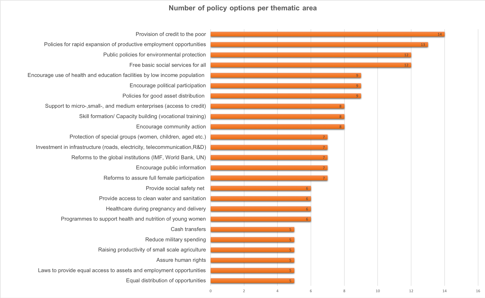

```{r setup, include=FALSE}
knitr::opts_chunk$set(echo = TRUE)
```

## Analysis 

- **Policy** – A course or principle of action adopted or proposed by an organization or individual. Policy is a deliberate system of guidelines to guide decisions and achieve rational outcomes. 
- **Human Development** - Human development is defined as the process of enlarging people’s freedoms and opportunities and improving their well-being
- **Human Development Index** - The HDI is a summary measure of human development.he HDI is a summary composite measure of a country's average achievements in three basic aspects of human development: health, knowledge and standard of living. It is a measure of a country's average achievements in three dimensions of human development


**HDI Aspects**:

- a long and healthy life, as measured by life expectancy at birth;
- knowledge, as measured by mean years of schooling and expected years of schooling; and
- a decent standard of living, as measured by GNI per capita in PPP terms in US$.

**HDI consequences and implications**: 

- The HDI is used to capture the attention of policy-makers, the media and nongovernmental organizations, and to change the focus from the usual economic statistics to human outcomes. It was created to re-emphasize that people and their capabilities should be the ultimate criteria for assessing the development of a country, not economic growth.

**Course of action/recommendation**
- More educators, Jobs and medical specialists to improve HDI



**Extra Sources on HDI**

- http://hdr.undp.org/en/content/policies-human-development-0
- http://hdr.undp.org/en/content/human-development-index-hdi 
- https://www.who.int/data/nutrition/nlis/info/human-development-index

Importing libraries 
```{r warning=FALSE, message=FALSE}
library(dplyr)
library(readxl)
library(tidygeocoder)
library(sf)
library(mapview)
library(RColorBrewer)
library(plotly)
```


Importing data 
```{r warning=FALSE, message=FALSE}
data <- read_excel("geo_NCdata.xlsx")
```


## Human Development Index data
```{r warning=FALSE, message=FALSE}
hdi_data <- select(data, c("City", "Education", "Income", "Occupation", 
                       "Health Status", "Housing",
                       "latitude", "longitude"))
```


```{r warning=FALSE, message=FALSE}
head(hdi_data)
```


## Distribution Analysis 
- `Education:` Primary education ( % > 20 years old with primary education only), Matric pass rate (% Matric pass rate 2017)
- `Income:` Average per capita income (personal income), Population living below breadline (% population living below national mean level of living in 2011) , Social grant dependency (% population receiving social grants)
-	`Occupation:` Unskilled workers (% of unskilled workers)
-	`Health Status:` HIV/AIDS status (% Population with HIV/AIDS)
-	`Housing:` Informal housing (% population living in informal housing units)
```{r warning=FALSE, message=FALSE}
fig <- hdi_data %>%
  plot_ly(
    y = ~Education,
    type = 'violin',
    box = list(visible = T),meanline = list(visible = T), x0 = 'Education') 
fig <- fig %>%
  layout(
    title = "Distribution of Education",
    yaxis = list(title = "%", zeroline = F))

fig
```


Cities/Towns that are not geocoded 
```{r warning=FALSE, message=FALSE}
hdi_data[rowSums(is.na(hdi_data)) > 0,]$City
```


Removing Cities that are not geocoded 
```{r warning=FALSE, message=FALSE}
locations_hdi <- subset(hdi_data, !is.na(hdi_data$longitude) & !is.na(hdi_data$latitude))
```

## K-means Cluster Analysis
- Clustering is a broad set of techniques for finding subgroups of observations within a data set. When we cluster observations, we want observations in the same group to be similar and observations in different groups to be dissimilar. Because there isn’t a response variable, this is an unsupervised method, which implies that it seeks to find relationships between the n observations without being trained by a response variable. Clustering allows us to identify which observations are alike, and potentially categorize them therein. K-means clustering is the simplest and the most commonly used clustering method for splitting a dataset into a set of k groups. In this case, clustering will aid in finding Cities/Towns with similar Human Development Index.
- k-means clustering is a method of vector quantization, originally from signal processing, *that aims to partition n observations into k clusters in which each observation belongs to the cluster with the nearest mean, serving as a prototype (centroid) of the cluster*. 

- Clustering is the process of grouping data objects using a similarity measure. 
- Clustering can be hierarchical or partitional, exclusive, overlapping or fuzzy, and complete or partial.
- K-Means is a partitional clustering technique; data objects are divided into non-overlapping groups.
- K-Means is a prototype-based clustering
- A prototype-based cluster is represented by a prototype such that all members within a cluster are close to the corresponding prototype.
- Centroid and medoid are two commonly used prototypes.
- K-Means clustering learns properties of a set of data points and forms partitions called clusters, that represent data with similar properties. For continuous data, each cluster is represented by the centroid which is the mean of cluster members.

## Clustering the data 
- Cluster Info: https://www.analyticsvidhya.com/blog/2016/11/an-introduction-to-clustering-and-different-methods-of-clustering/
- Cluster Meaning: a group of similar things or people positioned or occurring closely together.
- Cluster Meaning (Statistic): (of data points) have similar numerical values.
- Cluster Meaning (Statistic) example: "students tended to have marks clustering around 70 per cent"

### Standardizing data 
- Standardizing (scaling) data to remove variations due to different measurement scales
```{r warning=FALSE, message=FALSE}
locations_hdi_scale <- scale(select(locations_hdi,
                                   c("Education", "Income", "Occupation", 
                       "Health Status", "Housing")))
```


### Assessing Clustering Tendency (ACT)
- ACT evaluates whether the data set contains meaningful clusters or not (feasibility of the cluster analysis)
- Method: Statistical (Hopkins statistic)
- The Hopkins statistic is used to assess the clustering tendency of a data set by measuring the probability that a given data set is generated by a uniform data distribution,it tests the spatial randomness of the data.
- A Hopkins statistic(H) value of about 0.5 means that the data is uniformly distributed
- Null hypothesis: the data set D is uniformly distributed (i.e., no meaningful clusters)
- Alternative hypothesis: the data set D is not uniformly distributed (i.e.contains meaningful clusters)
- If the value of Hopkins statistic is close to zero, then we can reject the null hypothesis and conclude that the data set D is significantly clusterable
```{r warning=FALSE, message=FALSE}
#hopkins(locations_hdi_scale, n = nrow(locations_hdi_scale)-1)
```


### Estimating the optimal number of clusters
- Methods: Elbow method (within sum of square) and Silhouette method 
- library: factoextra 
```{r warning=FALSE, message=FALSE}
library(factoextra)
```


```{r warning=FALSE, message=FALSE}
fviz_nbclust(locations_hdi_scale, kmeans, method = "wss")
```


```{r warning=FALSE, message=FALSE}
fviz_nbclust(locations_hdi_scale, kmeans, method =  "silhouette")
```

### K-means Clustering 
- 2 number of clusters will be ideal for grouping observation as shown in the estimation methods above
```{r warning=FALSE, message=FALSE}
set.seed(123)
```


```{r warning=FALSE, message=FALSE}
locations_hdi_cluster <- kmeans(locations_hdi_scale, 
                               centers = 2, nstart = 25)
```


```{r warning=FALSE, message=FALSE}
library(ggplot2)
library(plotly)
```

### Cluster Visual Assessment 
- Observations are represented by points in the plot, using principal components if ncol(data) > 2.
- PCA is used in exploratory data analysis and for making predictive models. It is commonly used for dimensionality reduction by projecting each data point onto only the first few principal components to obtain lower-dimensional data while preserving as much of the data's variation as possible.
```{r warning=FALSE, message=FALSE}
ggplotly(fviz_cluster(locations_hdi_cluster, data = locations_hdi_scale) +
           theme_minimal() +
           theme(legend.position = "none") +
           ggtitle("Human Development Index Clusters (Groups)"))
```


Adding the clusters to the Human Development Data Frame
```{r warning=FALSE, message=FALSE}
locations_hdi$Cluster <- as.factor(locations_hdi_cluster$cluster)
```


```{r warning=FALSE, message=FALSE}
head(locations_hdi)
```


### Cluster Mean
- Creating a Human Development Index data frame 
```{r warning=FALSE, message=FALSE}
hdi_clust <- select(locations_hdi, c("Education", "Income", "Occupation", 
                       "Health Status", "Housing"))
```

- Computing the cluster mean the different Natural Resources 
- This informs on how natural resources vary by group
- The cluster centers assist in evaluating the distinctness of clusters. Thereby, suggesting whether or not cluster analysis was executed properly
```{r warning=FALSE, message=FALSE}
hdi_clust_table <- aggregate(hdi_clust,
                            by=list(cluster= locations_hdi_cluster$cluster),
                            mean)
```


```{r warning=FALSE, message=FALSE}
hdi_clust_table
```

### Human Development Index Clusters
- Plotly default color list: https://stackoverflow.com/questions/40673490/how-to-get-plotly-js-default-colors-list
```{r warning=FALSE, message=FALSE}
# locations_nr %>%
#       group_by(Cluster) %>%
#       summarise(n = n()) %>%
#       arrange(n) %>%
#       mutate(Cluster = factor(Cluster, levels = unique(Cluster))) %>%
#       plot_ly(x = ~n, y = ~Cluster, type = "bar") %>%
#       layout(title = "Natural Resource Grouping", yaxis = list(title = "Cluster"),
#              xaxis = list(title = "Number of Cities/Towns"))

ggplotly(locations_hdi %>%
      group_by(Cluster) %>%
      summarise(No_of_Cities = n()) %>%
      arrange(No_of_Cities) %>%
      mutate(Cluster = factor(Cluster, levels = unique(Cluster))) %>%
      ggplot(aes(x = Cluster, y = No_of_Cities)) +
      geom_bar(stat = "identity",
               fill = "#1f77b4") +
      geom_text(aes(label = No_of_Cities),
                vjust = -0.25) +
      coord_flip() +
      labs(x = "Cluster", 
           y = "Number of Cities/Towns",
           title = "Human Development Grouping (Clusters)") +
      theme_minimal())
```

### Viewing Mapview according to clusters
- SF object of cluster data for Human Development Index
```{r warning=FALSE, message=FALSE}
Human_Development <- st_as_sf(locations_hdi, coords = c("longitude", "latitude"), crs = 4326)
```

- Kimberley outlier Education level makes sense, especially since Kimberley is the provincial (Northern Cape) capital  
```{r warning=FALSE, message=FALSE}
mapview(Human_Development, 
        zcol = "Cluster")
```


```{r warning=FALSE, message=FALSE}

```


```{r warning=FALSE, message=FALSE}

```


```{r warning=FALSE, message=FALSE}

```


```{r warning=FALSE, message=FALSE}

```


```{r warning=FALSE, message=FALSE}

```


```{r warning=FALSE, message=FALSE}

```


```{r warning=FALSE, message=FALSE}

```


```{r warning=FALSE, message=FALSE}

```


```{r warning=FALSE, message=FALSE}

```


```{r warning=FALSE, message=FALSE}

```


```{r warning=FALSE, message=FALSE}

```


```{r warning=FALSE, message=FALSE}

```


```{r warning=FALSE, message=FALSE}

```


```{r warning=FALSE, message=FALSE}

```


```{r warning=FALSE, message=FALSE}

```


```{r warning=FALSE, message=FALSE}

```


```{r warning=FALSE, message=FALSE}

```


```{r warning=FALSE, message=FALSE}

```


```{r warning=FALSE, message=FALSE}

```


```{r warning=FALSE, message=FALSE}

```


```{r warning=FALSE, message=FALSE}

```


```{r warning=FALSE, message=FALSE}

```


```{r warning=FALSE, message=FALSE}

```


```{r warning=FALSE, message=FALSE}

```


```{r warning=FALSE, message=FALSE}

```


```{r warning=FALSE, message=FALSE}

```


```{r warning=FALSE, message=FALSE}

```


```{r warning=FALSE, message=FALSE}

```


```{r warning=FALSE, message=FALSE}

```


```{r warning=FALSE, message=FALSE}

```


```{r warning=FALSE, message=FALSE}

```


```{r warning=FALSE, message=FALSE}

```


```{r warning=FALSE, message=FALSE}

```


```{r warning=FALSE, message=FALSE}

```


```{r warning=FALSE, message=FALSE}

```


```{r warning=FALSE, message=FALSE}

```


```{r warning=FALSE, message=FALSE}

```


```{r warning=FALSE, message=FALSE}

```


```{r warning=FALSE, message=FALSE}

```


```{r warning=FALSE, message=FALSE}

```


```{r warning=FALSE, message=FALSE}

```


```{r warning=FALSE, message=FALSE}

```


```{r warning=FALSE, message=FALSE}

```


```{r warning=FALSE, message=FALSE}

```


```{r warning=FALSE, message=FALSE}

```


```{r warning=FALSE, message=FALSE}

```


```{r warning=FALSE, message=FALSE}

```


```{r warning=FALSE, message=FALSE}

```


```{r warning=FALSE, message=FALSE}

```


```{r warning=FALSE, message=FALSE}

```


```{r warning=FALSE, message=FALSE}

```


```{r warning=FALSE, message=FALSE}

```


```{r warning=FALSE, message=FALSE}

```


```{r warning=FALSE, message=FALSE}

```


```{r warning=FALSE, message=FALSE}

```


```{r warning=FALSE, message=FALSE}

```


```{r warning=FALSE, message=FALSE}

```


```{r warning=FALSE, message=FALSE}

```


```{r warning=FALSE, message=FALSE}

```


```{r warning=FALSE, message=FALSE}

```


```{r warning=FALSE, message=FALSE}

```


```{r warning=FALSE, message=FALSE}

```


```{r warning=FALSE, message=FALSE}

```


```{r warning=FALSE, message=FALSE}

```


```{r warning=FALSE, message=FALSE}

```


```{r warning=FALSE, message=FALSE}

```


```{r warning=FALSE, message=FALSE}

```


```{r warning=FALSE, message=FALSE}

```


```{r warning=FALSE, message=FALSE}

```


```{r warning=FALSE, message=FALSE}

```


```{r warning=FALSE, message=FALSE}

```


```{r warning=FALSE, message=FALSE}

```


```{r warning=FALSE, message=FALSE}

```


```{r warning=FALSE, message=FALSE}

```


```{r warning=FALSE, message=FALSE}

```


```{r warning=FALSE, message=FALSE}

```


```{r warning=FALSE, message=FALSE}

```


```{r warning=FALSE, message=FALSE}

```


```{r warning=FALSE, message=FALSE}

```


```{r warning=FALSE, message=FALSE}

```


```{r warning=FALSE, message=FALSE}

```


```{r warning=FALSE, message=FALSE}

```


```{r warning=FALSE, message=FALSE}

```


```{r warning=FALSE, message=FALSE}

```


```{r warning=FALSE, message=FALSE}

```


```{r warning=FALSE, message=FALSE}

```


```{r warning=FALSE, message=FALSE}

```


```{r warning=FALSE, message=FALSE}

```


```{r warning=FALSE, message=FALSE}

```


```{r warning=FALSE, message=FALSE}

```


```{r warning=FALSE, message=FALSE}

```


```{r warning=FALSE, message=FALSE}

```


```{r warning=FALSE, message=FALSE}

```


```{r warning=FALSE, message=FALSE}

```


```{r warning=FALSE, message=FALSE}

```


```{r warning=FALSE, message=FALSE}

```


```{r warning=FALSE, message=FALSE}

```


```{r warning=FALSE, message=FALSE}

```


```{r warning=FALSE, message=FALSE}

```


```{r warning=FALSE, message=FALSE}

```


```{r warning=FALSE, message=FALSE}

```


```{r warning=FALSE, message=FALSE}

```


```{r warning=FALSE, message=FALSE}

```


```{r warning=FALSE, message=FALSE}

```


```{r warning=FALSE, message=FALSE}

```


```{r warning=FALSE, message=FALSE}

```


```{r warning=FALSE, message=FALSE}

```


```{r warning=FALSE, message=FALSE}

```


```{r warning=FALSE, message=FALSE}

```


```{r warning=FALSE, message=FALSE}

```


```{r warning=FALSE, message=FALSE}

```


```{r warning=FALSE, message=FALSE}

```


```{r warning=FALSE, message=FALSE}

```


```{r warning=FALSE, message=FALSE}

```


```{r warning=FALSE, message=FALSE}

```


```{r warning=FALSE, message=FALSE}

```


```{r warning=FALSE, message=FALSE}

```


```{r warning=FALSE, message=FALSE}

```


```{r warning=FALSE, message=FALSE}

```


```{r warning=FALSE, message=FALSE}

```


```{r warning=FALSE, message=FALSE}

```


```{r warning=FALSE, message=FALSE}

```


```{r warning=FALSE, message=FALSE}

```


```{r warning=FALSE, message=FALSE}

```


```{r warning=FALSE, message=FALSE}

```


```{r warning=FALSE, message=FALSE}

```


```{r warning=FALSE, message=FALSE}

```


```{r warning=FALSE, message=FALSE}

```


```{r warning=FALSE, message=FALSE}

```


```{r warning=FALSE, message=FALSE}

```


```{r warning=FALSE, message=FALSE}

```


```{r warning=FALSE, message=FALSE}

```


```{r warning=FALSE, message=FALSE}

```


```{r warning=FALSE, message=FALSE}

```


```{r warning=FALSE, message=FALSE}

```


```{r warning=FALSE, message=FALSE}

```


```{r warning=FALSE, message=FALSE}

```


```{r warning=FALSE, message=FALSE}

```


```{r warning=FALSE, message=FALSE}

```


```{r warning=FALSE, message=FALSE}

```


```{r warning=FALSE, message=FALSE}

```


```{r warning=FALSE, message=FALSE}

```


```{r warning=FALSE, message=FALSE}

```


```{r warning=FALSE, message=FALSE}

```


```{r warning=FALSE, message=FALSE}

```


```{r warning=FALSE, message=FALSE}

```


```{r warning=FALSE, message=FALSE}

```


```{r warning=FALSE, message=FALSE}

```


```{r warning=FALSE, message=FALSE}

```


```{r warning=FALSE, message=FALSE}

```


```{r warning=FALSE, message=FALSE}

```


```{r warning=FALSE, message=FALSE}

```


```{r warning=FALSE, message=FALSE}

```


```{r warning=FALSE, message=FALSE}

```


```{r warning=FALSE, message=FALSE}

```


```{r warning=FALSE, message=FALSE}

```


```{r warning=FALSE, message=FALSE}

```


```{r warning=FALSE, message=FALSE}

```

